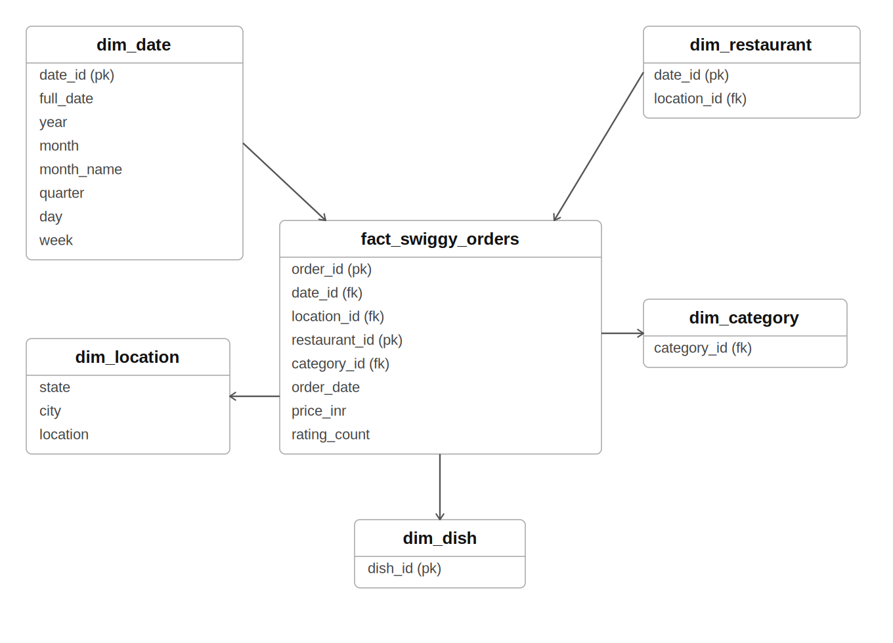

# 🍽️ Swiggy Sales Analysis — MySQL Project

> **End-to-end SQL project covering data cleaning, star schema dimensional modelling, and deep-dive KPI analysis on a real-world Swiggy food delivery dataset.**

---


---

## 📌 Table of Contents

- [Project Overview](#-project-overview)
- [Dataset Description](#-dataset-description)
- [Project Architecture](#-project-architecture)
- [Phase 1 — Data Cleaning & Validation](#-phase-1--data-cleaning--validation)
- [Phase 2 — Dimensional Modelling (Star Schema)](#-phase-2--dimensional-modelling-star-schema)
- [Phase 3 — KPI Development & Business Analysis](#-phase-3--kpi-development--business-analysis)
- [Key Insights](#-key-insights)
- [Tools Used](#-tools-used)
- [How to Run](#-how-to-run)
- [Folder Structure](#-folder-structure)
- [Author](#-author)

---

## 📖 Project Overview

This project performs a **full analytical lifecycle** on a Swiggy food delivery dataset using **MySQL**. The workflow starts from raw, unclean data and progresses through validation, dimensional modelling, and business intelligence reporting.

The project answers critical business questions such as:

- Which cities and states drive the most orders and revenue?
- What are the top-performing restaurants, cuisines, and dishes?
- How does order volume trend across months, quarters, and days of the week?
- What does the customer spending distribution look like?
- How are dish ratings distributed across the platform?

---

## 📦 Dataset Description

The raw source table `swiggy` contains food delivery transaction records with the following fields:

| Column | Description |
|---|---|
| `state` | Indian state where the order was placed |
| `city` | City of delivery |
| `orderdate` | Date the order was placed |
| `restaurantname` | Name of the restaurant |
| `location` | Specific locality/area within the city |
| `category` | Cuisine category (e.g., Indian, Chinese, Italian) |
| `dishname` | Name of the dish ordered |
| `price` | Price of the dish in Indian Rupees |
| `rating` | Dish/restaurant rating (1–5 scale) |
| `ratingcount` | Number of ratings received |

---

## 🏗️ Project Architecture

```
Raw Data (swiggy)
        │
        ▼
┌─────────────────────┐
│  Phase 1            │
│  Data Cleaning &    │
│  Validation         │
│  - Null Checks      │
│  - Blank Checks     │
│  - Duplicate Find   │
│  - Duplicate Remove │
└────────┬────────────┘
         │
         ▼
┌─────────────────────┐
│  Phase 2            │
│  Star Schema        │
│  Dimensional Model  │
│  - dim_date         │
│  - dim_location     │
│  - dim_restaurant   │
│  - dim_category     │
│  - dim_dish         │
│  - fact_swiggy_orders│
└────────┬────────────┘
         │
         ▼
┌─────────────────────┐
│  Phase 3            │
│  KPI Analysis &     │
│  Business Insights  │
└─────────────────────┘
```

---

## 🧹 Phase 1 — Data Cleaning & Validation

Before any analysis could begin, the raw data was thoroughly validated and cleaned across four steps.

### 1.1 Null Check
Scanned every business-critical column — State, City, Order_Date, Restaurant_Name, Location, Category, Dish_Name, Price_INR, Rating, and Rating_Count — to quantify missing values and understand the extent of data gaps.

### 1.2 Blank / Empty String Check
Detected fields containing whitespace-only or empty string values that would pass a NULL check but still cause silent errors in groupings, joins, and aggregations.

### 1.3 Duplicate Detection
Grouped records across all business-critical columns to surface exact duplicate rows and measure how many redundant entries existed in the dataset.

### 1.4 Duplicate Removal
Applied `ROW_NUMBER()` with a `PARTITION BY` on all key columns to rank duplicate rows. All rows ranked greater than 1 were deleted, retaining exactly one clean copy of each unique record.

---

## ⭐ Phase 2 — Dimensional Modelling (Star Schema)

A **Star Schema** was designed and built to organize data for fast, reliable analytical queries and seamless BI reporting.

### Why Star Schema?
Dimensional modelling separates descriptive information into small, focused dimension tables and keeps all measurable values in a central fact table. This structure:

- Reduces data duplication across the dataset
- Makes aggregations faster and more accurate
- Integrates seamlessly with BI tools like Power BI and Tableau
- Provides a clean, scalable foundation for any reporting layer

---

### ERD — Star Schema



```

### Dimension Tables Built

| Table | Key Columns |
|---|---|
| `dim_date` | date_id, order_date, year, month, quarter, week |
| `dim_location` | location_id, state, city, location |
| `dim_restaurant` | restaurant_id, restaurant_Name |
| `dim_category` | category_id, category |
| `dim_dish` | dish_id, dish_Name |

Each dimension was populated with **distinct values** from the cleaned source table. The central fact table `fact_swiggy_orders` holds all measurable values — Price_INR, Rating, Rating_Count — along with foreign keys resolving to every dimension.

---

## 📊 Phase 3 — KPI Development & Business Analysis

### 3.1 Basic KPIs

The following platform-wide metrics were computed as the foundation of the analysis:

| KPI | Description |
|---|---|
| **Total Orders** | Count of all order records |
| **Total Revenue (INR Million)** | Sum of price_inr converted to millions |
| **Average Dish Price** | Mean price across all dishes |
| **Average Rating** | Mean rating across all orders |

---

### 3.2 Date-Based Analysis

Order volumes were analysed across multiple time dimensions to identify patterns and growth trends:

- **Monthly Trends** — Orders aggregated by calendar month to spot seasonal peaks and slow periods
- **Quarterly Trends** — Orders grouped by quarter (Q1–Q4) for high-level business reporting
- **Year-wise Growth** — Annual order counts to measure platform growth over time
- **Day-of-Week Patterns** — Orders broken down by Monday through Sunday to identify peak delivery days

---

### 3.3 Location-Based Analysis

Geographic performance was evaluated at both city and state level:

- **Top 10 Cities by Order Volume** — Ranked cities driving the highest number of orders
- **Revenue Contribution by State** — INR revenue attributed to each state to identify high-value markets

---

### 3.4 Food Performance

Restaurant, cuisine, and dish-level metrics were computed to understand what customers are actually ordering:

- **Top 10 Restaurants by Orders** — Highest-volume restaurants on the platform
- **Top Cuisine Categories** — Ranking of Indian, Chinese, Italian, and other categories by order count
- **Most Ordered Dishes** — The 10 most frequently ordered individual dishes
- **Cuisine Performance** — Combined view of order volume and average rating per cuisine type

---

### 3.5 Customer Spending Insights

All orders were bucketed into spend ranges to understand customer price sensitivity:

| Spend Bucket | Range |
|---|---|
| Budget | Under ₹100 |
| Economy | ₹100 – ₹199 |
| Mid-Range | ₹200 – ₹299 |
| Premium | ₹300 – ₹499 |
| Luxury | ₹500+ |

Total order count was computed for each bucket to reveal where the majority of customers spend.

---

### 3.6 Ratings Distribution

Dish ratings were grouped into bands from 1 through 5 to understand overall platform quality and customer satisfaction levels.

---

## 💡 Key Insights

| Insight | Finding |
|---|---|
| 📍 **Top City** | Identified the city with the highest order volume |
| 🏆 **Best Cuisine** | Indian food dominates order share across the platform |
| 💰 **Revenue Leader** | Top state contributes the majority of total INR revenue |
| 📅 **Peak Day** | Weekends show significantly higher order volumes |
| ⭐ **Avg Platform Rating** | Computed across all dishes on the platform |
| 🛒 **Most Popular Spend** | Majority of orders fall in the ₹100–₹299 range |

---

## 🛠️ Tools Used

| Tool | Purpose |
|---|---|
| **MySQL 8.0** | Data cleaning, schema creation, and all analysis queries |
| **MySQL Workbench** | Query execution and ERD visualization |
| **GitHub** | Version control and project showcase |

---

> ⭐ *If you found this project helpful, consider giving it a star on GitHub!*
